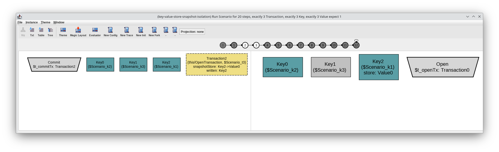

---

title: Key-Value-Store with snapshot isolation
author: Tristan Schönhals
date: July 2023

---


# Key-Value-Store with Snapshot Isolation using Alloy 6
This specification is based on a specification in TLA+.
You may find the [TLA+ example on Wikipedia](https://en.wikipedia.org/wiki/TLA%2B#Examples).

## What is a key-value-store?
A key-value-store is a datastructure mapping keys to values of any type.
The store can be changed with three distinct operations:

- Add(k,v):         Add a value v to the store under key k
- Update(k,v):      Update the value in the store under key k to v
- Remove(k):        Remove the key k from the store

Since read operations do not affect the models state, they needn't be specified.

> See key-value-store-simple.als for an example implementation

## What is snapshot isolation
Snapshot isolation is an isolation level implementation, which prevents most anomalies with concurrent
transaction mentioned in the SQL standard. Specifically "Dirty Write", "Dirty Read", "Non-repeatable read" and "Phantom row".
Oracle databases use this implementation when specifying the isolation level `serializable`.
However, this is inconsistent with the SQL standard, which defines that all transactions have to be
serializable to fulfill this level. Due to the "Write Skew" anomaly, which will be demonstrated later,
this isolation level isn't actually serializable.[[Renz22]](https://esb-dev.github.io/mat/IsoLevel.pdf)

This model confirms that write skew is possible.

### Implementation
The store may only be changed by transactions, which -- when opened -- take a snapshot
of the entire store. All read operations in the transaction see the snapshot and therefore
a consistent store.

Concurrent transactions may only write to different keys. To achieve this,
each transaction remembers to which keys it writes and -- when committed -- it notifies
all other open transactions about write operations they missed.
This allows open transactions to check for write-write conflicts before committing
and, if need be, to roll back.

To implement snapshot isolation, the key-values-stores operations change/get extended to the following:

- Open(t):          Open a new transaction t
- Add(t,k,v):       In transaction t, add a value v to the snapshot under key k
- Update(t,k,v):    In transaction t, update the value in the snapshot under key k to v
- Remove(t,k):      In transaction t, remove the key k from the snapshot
- Rollback(t):      Rollback transaction t, don't change the store
- Commit(t):         Commit transaction t, update the store according to the snapshots changes and notify other ongoing transactions about possible write-write conflicts

Read operations needn't be specified for snapshot isolation either. Snapshot reads don't directly
affect anything.
It's important to keep this in mind when checking for anomalies as they tend to be focused on reading data incorrectly.
However this can be substituted by simply checking the snapshot of a transaction for certain values.

> This document embeds excerpts of the specification, however see key-value-store-snapshot-isolation.als for the entire specification.
> It also contains some run configurations and scenarios for playing around with the key-value-store.

```alloy
-- ISVS project: Key-value-store with snapshot isolation
-- Ported from TLA+ @ https://en.wikipedia.org/wiki/TLA%2B#Examples
-- Part II: Snapshot isolation

-- Macro for relations that don't change during transitions
let unchanged[r] { (r)' = (r) }

-- Set of all keys in the key-value-store
sig Key {
	var store: lone Value										-- Each key points to one or no value, represents the current state of the store
}

-- Set of all values
sig Value {}

-- Set of all transactions
sig Transaction {
	var snapshotStore: Key -> lone Value,						-- Snapshot of `store` for this transaction
	var written: set Key,										-- Keys written to in this transaction
	var missed: set Key,										-- Writes (from concurrently committed transactions) invisible to this transaction
}

var sig OpenTransaction in Transaction {}

-- Open a new transaction
pred openTx[t: Transaction] {
	t not in OpenTransaction
	OpenTransaction' = OpenTransaction + t
	snapshotStore' = snapshotStore + (t -> store)

	unchanged[written]
	unchanged[missed]
	unchanged[store]
}

-- Add a key-value-pair to an open transaction
pred add[t: Transaction, k: Key, v: Value] {
	t in OpenTransaction
	no t.snapshotStore[k]										-- Key may not have value yet, otherwise update must be done
	snapshotStore' = snapshotStore + (t -> k -> v)
	written' = written + (t -> k)								-- Add k to t.written
	
	unchanged[OpenTransaction]
	unchanged[missed]
	unchanged[store]
}

-- Update the value of a key-value-pair in an open transaction
pred update[t: Transaction, k: Key, v: Value] {
	t in OpenTransaction
	some t.snapshotStore[k]										-- Key must have value, otherwise add must be done
	snapshotStore' = snapshotStore - (t -> k -> Value) + (t -> k -> v)
	written' = written + (t -> k)								-- Add k to t.written
	
	unchanged[OpenTransaction]
	unchanged[missed]
	unchanged[store]
}

-- Remove a key-value-pair from an open transaction
pred remove[t: Transaction, k: Key] {
	t in OpenTransaction
	some t.snapshotStore[k]										-- Key must have value
	snapshotStore' = snapshotStore - (t -> k -> Value)
	written' = written + (t -> k)								-- Add k to t.written

	unchanged[OpenTransaction]
	unchanged[missed]
	unchanged[store]
}

-- Rollback open transaction, doesn't affect store
pred rollbackTx[t: Transaction] {
	t in OpenTransaction
	OpenTransaction' = OpenTransaction - t
	snapshotStore' = snapshotStore - t <: snapshotStore
	written' = written - (t -> Key)
	missed' = missed - (t -> Key)

	unchanged[store]
}

-- Commit open transaction, merge with store
pred commitTx[t: Transaction] {
	t in OpenTransaction
	no (t.missed & t.written)
	OpenTransaction' = OpenTransaction - t
	snapshotStore' = snapshotStore - t <: snapshotStore
	written' = written - (t -> Key)

	-- All other currently open transactions add what t has written to their set of missed writes
	all tx: Transaction | tx.missed'= (tx in (OpenTransaction - t) implies tx.missed + t.written else none)
	-- Update all keys in store that t has written too (including removal!)
	all k: Key | store'[k] = (k in t.written implies t.snapshotStore[k] else store[k])
}
```

Now all that's missing from the specification before it can be tested are transitions between states.
For better visualization, the specification uses a Transition signature, which visualizes which transition
happens in each step.

> A theme needs to be configured accordingly, to make use of this feature.
> See key-value-store-snapshot-isolation.thm as an example

```alloy
-- Do nothing / stutter (not necessary, but is useful for debugging)
pred nop {
	unchanged[store]
	unchanged[OpenTransaction]
	unchanged[snapshotStore]
	unchanged[written]
	unchanged[missed]
}

-- Initial state
pred init {
	no store 															-- no values are stored
	no OpenTransaction											-- no open transactions
	no snapshotStore												-- no snapshots
	no written														-- no writes yet
	no missed															-- no missed writes yet
}

-- Next state transition
fun next: Transition {
	t_openTx.Transaction 
	+ t_add.Value.Key.Transaction
	+ t_update.Value.Key.Transaction
	+ t_remove.Key.Transaction
	+ t_rollbackTx.Transaction
	+ t_commitTx.Transaction
	+ t_nop
}

-- Begin with init state and always transition using `next`
fact KeyValueStore {
	init
	always some { this/next }
}


-- These functions are used to wrap transition predicates
-- This allows showing in the visualizer which transition happens in each step
enum Transition { Open, Add, Update, Remove, Rollback, Commit, Nop }

fun t_openTx: Transition -> Transaction {
	{ tp: Open, t: Transaction | openTx[t] }
}

fun t_add: Transition -> Transaction -> Key -> Value {
	{ tp: Add, t: Transaction, k: Key, v: Value | add[t,k,v] }
}

fun t_update: Transition -> Transaction -> Key -> Value {
	{ tp: Update, t: Transaction, k: Key, v: Value | update[t,k,v] }
}

fun t_remove: Transition -> Transaction -> Key {
	{ tp: Remove, t: Transaction, k: Key | remove[t,k] }
}

fun t_rollbackTx: Transition -> Transaction {
	{ tp: Rollback, t: Transaction | rollbackTx[t] }
}

fun t_commitTx: Transition -> Transaction {
	{ tp: Commit, t: Transaction | commitTx[t] }
}

fun t_nop: Transition {
	{ tp: Nop | nop }
}
```

The following screenshot shows an example of the visualization with a theme applied.



Now the specification is ready to be checked for anomalies.

## Anomalies with snapshot isolation
The following assertions specify concrete scenarios for each of the previously mentioned anomalies.
The assertions assume that no two transactions can exist, with which the anomalous behaviour occurs.
If alloy finds a counterexample, the anomaly is indeed possible.

```alloy
-- Assertions assume the anomaly *cannot* occur. If a counterexample is found
-- the specified isolation strategy does not prevent the specified anomaly

assert DirtyWrite {
	-- Writes from concurrent transactions may not override each other
	no disj t1, t2: Transaction, k: Key, disj v1, v2: Value | {
		openTx[t1]
		;openTx[t2]
		;add[t1,k,v1]
		;add[t2,k,v2]
		;commitTx[t1]
		;commitTx[t2]
	}
}
check DirtyWrite expect 0

assert DirtyRead {
	-- Writes from concurrent transactions may not affect each others reads
	no disj t1, t2: Transaction, k: Key, disj v1, v2: Value | {
		-- Since the following add implies that k cannot have a value when t1 is opened
		-- The following condition is unnecessary, it does however make clearer what this intends to verify
		store[k] = v2
		;openTx[t1]
		;openTx[t2]
		;add[t1,k,v1]
		;t2.snapshotStore[k] = v1
	}
}
check DirtyRead expect 0

assert NonRepeatableRead {
	-- Writes from concurrently committed transactions may not affect reads of others
	-- Only commits before opening a transaction may be taken into account
	no disj t1, t2: Transaction, k: Key, disj v1, v2: Value | {
		store[k] = v1
		openTx[t1]
		;openTx[t2]
		;t1.snapshotStore[k] = v1
		;update[t2,k,v2]
		;commitTx[t2]
		;t1.snapshotStore[k] = v2
	}
}
check NonRepeatableRead expect 0

assert PhantomRow {
	-- Concurrent transactions may not add new rows (key-value-pairs) to each other
	no disj t1, t2: Transaction, k: Key, v: Value | {
		#store = 0
		openTx[t1]
		;openTx[t2]
		;#t1.snapshotStore = 0
		;add[t2,k,v]
		;commitTx[t2]
		-- Make sure commitTx[t2] and the verification occur at the same time.
		-- Otherwise t1 might have just added a new row itself
		#t1.snapshotStore = 1
	}
}
check PhantomRow expect 0

pred noDuplicateWrites {
	-- No transaction is allowed to add/update to a value, that's already in its snapshot
	-- This should ensure no duplicated values enter the store
	all t: Transaction | all v: t.snapshotStore[Key] | no k: Key | add[t,k,v] or update[t,k,v]
}
assert WriteSkew {
	-- Never writing an existing values should ensure no duplicated values in store
	always noDuplicateWrites implies always #store[Key] = #store
}
check WriteSkew expect 1
```

Running these through the analyzer confirms: Alloy can only find a counterexample
(implying the anomaly is possible) for "Write Skew".

### Write skew anomaly
A write skew occurrs when two transactions both concurrently read related data, update disjoint data based on the read information and commit.
> See [Snapshot Isolation Definition on Wikipedia](https://en.wikipedia.org/wiki/Snapshot_isolation#Definition)
> for a formal definition and another example of the write skew anomaly.

We now have shown that snapshot isolation does not account for this anomaly. As an example of true
serializability one may look at PostgreSQL 9.1, which introduced a new implementation called
`serializable snapshot isolation` (SSI), which prevents write skews! See [[Ports12]](https://arxiv.org/pdf/1208.4179v1.pdf), which describes designing and implementing this technique.
Of course the `serializable` isolation level can also be achieved using other implementations.
The two-phase lock protocol is a common example.

## Outlook
In future version, this model may be updated with specifications and verifications of single-phase and two-phase locking, the former still allowing write skew, while the latter should not.
